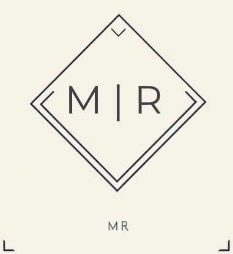
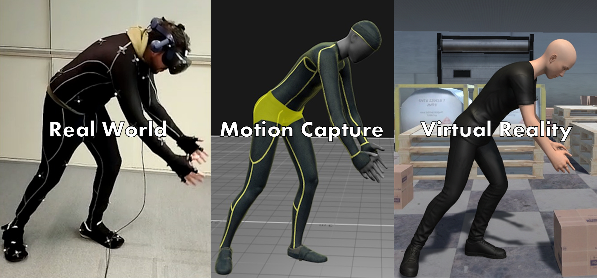
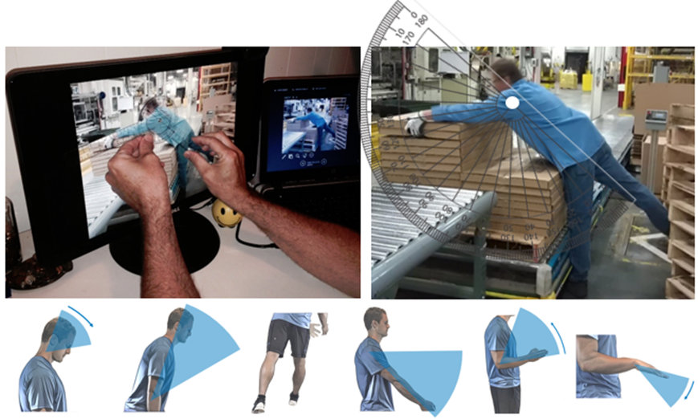

<!-- PROJECT LOGO -->
 

    

  <h3 align="center">Master Thesis Project</h3>
  <h2 align="center">Automatic Assessment of Body Ergonomics in Mixed Reality</h2>
  !!! INFO !!!: The complete project cannot be uploaded because some of the assets are subject to a fee and cannot be distributed. Instead, an alternative version of the Unity project will be uploaded in the future. This will include all scripts and a demo environment to test the project.   
  
## Quick Summary
This Unity3D project demonstrates how to stream full-body motion from OptiTrack/Motive into Unity to compute the ergonomic REBA-Score in real time and stream it into a Head-Up-Display. The core contribution is a plane-first angle method: joint orientations are projected onto anatomical planes (sagittal, frontal, transverse), measured as 2D angles (goniometer-style), and mapped into REBA tables A/B/C with modifiers (Activity, Force/Load, Coupling). The user is receiving a live biofeedback showing a color-coded risk score (1–15) reflecting the ergonomic quality.

## Introduction of the Project

Imagine you were wearing a pair of ultra-modern glasses. These glasses now show you a number that reflects an assessment of your posture, directly in your field of vision - for example, it could say "level 7 out of 15, increased risk" - would you spontaneously straighten up when you read this? Or let's say we use a traffic light system instead of a number system - green would tell you your posture is healthy, red is signaling a high risk and yellow would be tolerable risk - would *that* help you adopt a healthy posture?
It is precisely this reflex that was investigated with this project. To realize this a VR-supported system was developed that utilizes motion capturing to track people's current posture and produce a live-feeback using the REBA method developed by Hignett, S. and McAtamney, L. (2000) Rapid Entire Body Assessment.

This system was tested in a small pilot study with six participants in the mixed reality lab of the Frankfurt University of Applied Sciences. Each participant went through four conditions that were randomized with the balanced Latin square method. This was done so the we could investigate the interaction between independent variables. The pariticipants were instructed to do work on three different tasks. A semi-structured interview was performed an the following questionaires were used: NASA-TLX, IPQ, VEQ and additional questions designed by the researcher.

    

# Project: Automation of the REBA method
### First-person view of study tasks for participants

https://github.com/user-attachments/assets/c1a45c33-c953-487d-939c-18360891af3f

### Visual feedback of the automated REBA-HUD (Head-Up-Display)

https://github.com/user-attachments/assets/79112f15-45e6-479b-9054-e049d4268379

(<a href="#readme-top">back to top</a>)

## Dashboard inspired by the REBA-Worksheet
In order to give the user the possibility to pursue all of the REBA-method related data in real time with great detail, a dashboard was designed:

<h4>
Dashboard Detailed Overview
</h4>

1. **Start Study**  
Starts the actual measurement phase: live streaming of joint angles and the REBA computation for the current trial.

2. **Start Questionnaire**  
   Opens/starts the questionnaire, typically after a task, to collect subjective feedback (discomfort, effort, etc.).

3. **Shortcuts Enabled**  
   Toggles keyboard/controller shortcuts on or off, so you can trigger functions during measurement without clicking the UI buttons.

4. **Set Initial Stance**  
   Saves the current relaxed pose as the **individual neutral stance**. All joint angles are then computed relative to this user-specific baseline (useful for people who can’t fully straighten arms, have contractures, etc.).

5. **Release Initial Stance**  
   Clears the custom neutral stance and resets the system to the **default zero pose** of the model for angle calculations.

6. **Coloring Mode: Static**  
   Legacy development button. It was originally used to switch the visualization mode of the embedded REBA color display. In the current version it no longer has an active function.

7. **Avatar (3D Human Model)**  
   Real-time visualization of the participant’s posture. The avatar mirrors the tracked joint angles and provides an intuitive, immediate view of the current body configuration used for the REBA calculation.

8. **REBA – Table A & Score A (Trunk, Neck, Legs)**  
   Shows **Table A** of the REBA method: neck, trunk, and legs with their flexion/extension, adduction/abduction, and supination/pronation angles. The colored bars on the right are segment scores. The “Score A” line below summarizes posture plus Force/Load modifiers into the final **Score A**.

9. **REBA – Table B & Score B (Arms & Wrists)**  
   Shows **Table B**: upper arms, lower arms, and wrists with the same angle dimensions as Table A. Colored bars on the right show segment scores. The “Score B” line combines the arm/wrist posture scores and the **Coupling Score** into the final **Score B**.

10. **REBA – Score C and Overall REBA Score**  
    Combines the partial scores into the final REBA result. The **Table C Score** is derived from Score A and Score B. Together with the **Activity Score** it forms **Score C**, from which the final **REBA Score** is computed and displayed.

11. **Additional Scores – Stance / Load / Force (for Table A)**  
    Extra factors that modify **Score A**: stance type (e.g., unilateral stance on one leg), external load/weight, and high exerted force (true/false). These parameters adjust the Force/Load contribution in Table A.

12. **Additional Scores – Shoulders / Arm support (for Table B)**  
    Extra factors for **Table B**: elevated shoulders and presence/absence of arm support (e.g., arms resting on a surface). Both affect the final arm/shoulder risk rating and thus **Score B**.

13. **Additional Scores – Activity Factors (for Score C)**  
    Activity-related modifiers that contribute to the **Activity Score**: static postures held for longer durations, repeated actions, and rapid posture changes. These factors increase or decrease the final **Score C** and therefore the overall **REBA Score**.

(<a href="#readme-top">back to top</a>)

## Background - The REBA Method

<h3>REBA - Rapid Entire Body Assessment</h3>

REBA stands for Rapid Entire Body Assessment. It is a standardized procedure that allows for a quick whole-body posture assessment on the basis of angular positions. The entire posture is broken down into a single risk assessment that ranges from 1 to 15, i.e. from risk-free to full risk. The worksheet by ErgoPlus on the left summarizes the Reba method for quick application. The body is divided into six segments and (optimally) a health worker would compare a patient body segments with the illustrated angles to assess all parts of the posture and the corresponding risk values. <a href="BACKGROUND.md"><strong>Read more in the background info »</strong></a>

<table>
  <tr>
    <td width="49%">
    <h3>REBA Employee Assessmente Worksheet by ErgoPlus</h3>
    
    </td>
    <td width="49%">
    <h3>Angle Measurement Example by ErgoPlus</h3>
    
    </td>
  </tr>
</table>

#### Limitation of REBA
Logically in practice the REBA method cannot be applied to evaluate every single intermediate position. A patient will be observed through his/her work day and the trained personnel is searching for critical postures, e.g. climbing a ladder with heavy box. With REBA, we can tell how much of a risk a certain posture holds and it gives a base to begin an intervention. However, only postures that have actively been detected and evaluated can be improved, it is highly likely that many critical moments are simply overlooked.

    

(<a href="#readme-top">back to top</a>)

## The "Plane-First" idea
### Quick Summary
Why "plane-first"?

Problem: Euler angles are sequence-dependent; quaternions provide stable orientation, but no isolated plane angles; pure 3D vector angles mix motion components.

Solution: Via raycast we project to (anatomical) 3d-planes to transfrom 3D movements into 2D angles for the REBA method. This results in clean individual values per body segment exactly as required by REBA.

### Introduction
The REBA method evaluates postures in anatomical planes (sagittal for flexion/extension, frontal for abduction/adduction, transverse for rotation). With the use of motion capture systems and virtual reality is possible to track the movements of humans and give live REBA-assessments. With Unity 3D an algorithm can be designed as well as a virtual environment to give users scenarios in which they can perform tasks.

The problem with Unity 3D: Standard rotation toolkits don’t give those plane-isolated angles reliably in real time: Euler angles are sequence-dependent and break under mixed motions; quaternions are excellent for a final 3D orientation but don’t expose the separate plane components REBA needs. In practice this means a joint can look “well defined” mathematically while its flexion is numerically mixed with abduction and twist—hard to interpret and easy to misclassify. Plain vector angles in 3D tend to mix movement components across planes (flexion, abduction, rotation), which again conflicts with the plane-specific logic of REBA.

https://github.com/user-attachments/assets/92984b6f-f416-41e9-98bd-39f7d7f98e09

The "Plane-First" idea tackles the problem: instead of forcing a 3D orientation into anatomical planes (sagittal, frontal and transverse), we solve the problem by translating the orientation to 2D first. [CHECK THE VIDEO]: If we would like to measure the flexion angle of the lower arm, we attach the relevant anatomical plane i.e. a sagittal plane to its "parent" the upper arm. The movements of the lower arm are projected into that plane via a raycast from the wrist. The impact point of beam on the sagittal plane can be translated into 2D angle. Imagine the movable arm of a goniometer on a photo - the tip of the arm is represented by this impact point. Since only in-plane motion is measured, the value maps directly to REBA’s categorical wary of using anatomical planes and remains stable even when movements are complex. 
<a href="BACKGROUND.md"><strong>Read more in the background info »</strong></a>

(<a href="#readme-top">back to top</a>)

## REBA HUD – Low vs. High Risk

  
  

  <em>
  Comparison of the REBA-HUD presentation: on the left an example with low risk, on the right an example with high risk.
  </em>

The color-coded REBA HUD provides an at-a-glance overview of ergonomic risk while the user is in VR. Higher risk postures are highlighted with more critical colors, making it easy to spot dangerous positions and prioritize interventions. The HUD is displayed in the lower middle area of the headset’s visual field so that it stays visible without blocking the main task.

This project brings the REBA assessment method into virtual reality by automatically calculating REBA scores from tracked joint angles in 3D space. It mirrors the idea of using a goniometer in the real world, but does so continuously and in real time. In short, the system lets you perform REBA-based ergonomic assessments directly in VR, keeping them both practical and closely aligned with real-world applications.  
(Details on the scoring logic and implementation are documented in a separate file.)

(<a href="#readme-top">back to top</a>)

## Compact view of the UML diagram showing the workflow 

  <em>
  Comparison of the REBA-HUD presentation: on the left an example with low risk, on the right an example with high risk.
  </em>

### Hardware Setup Overview

  <em>
  Comparison of the REBA-HUD presentation: on the left an example with low risk, on the right an example with high risk.
  </em>

(<a href="#readme-top">back to top</a>)

